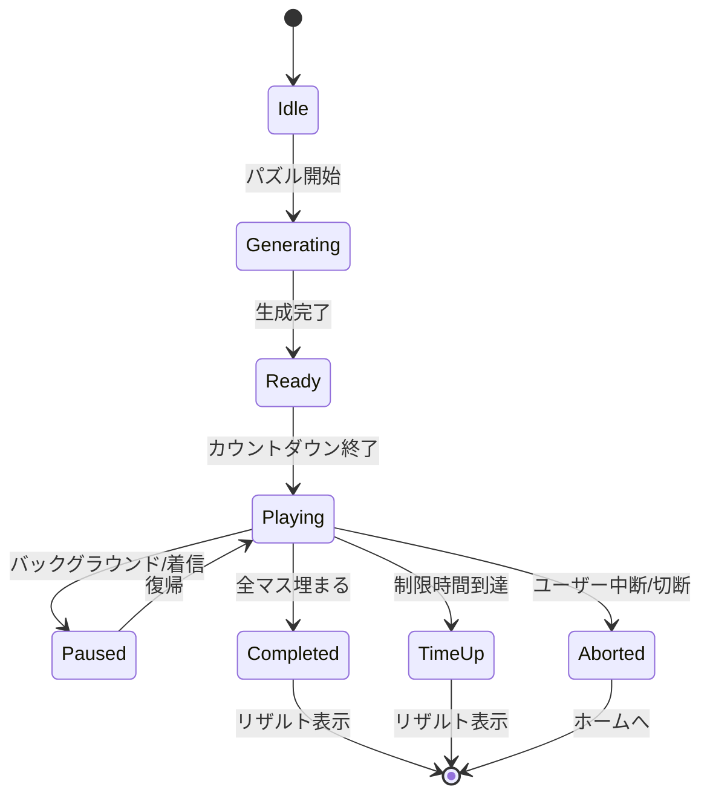
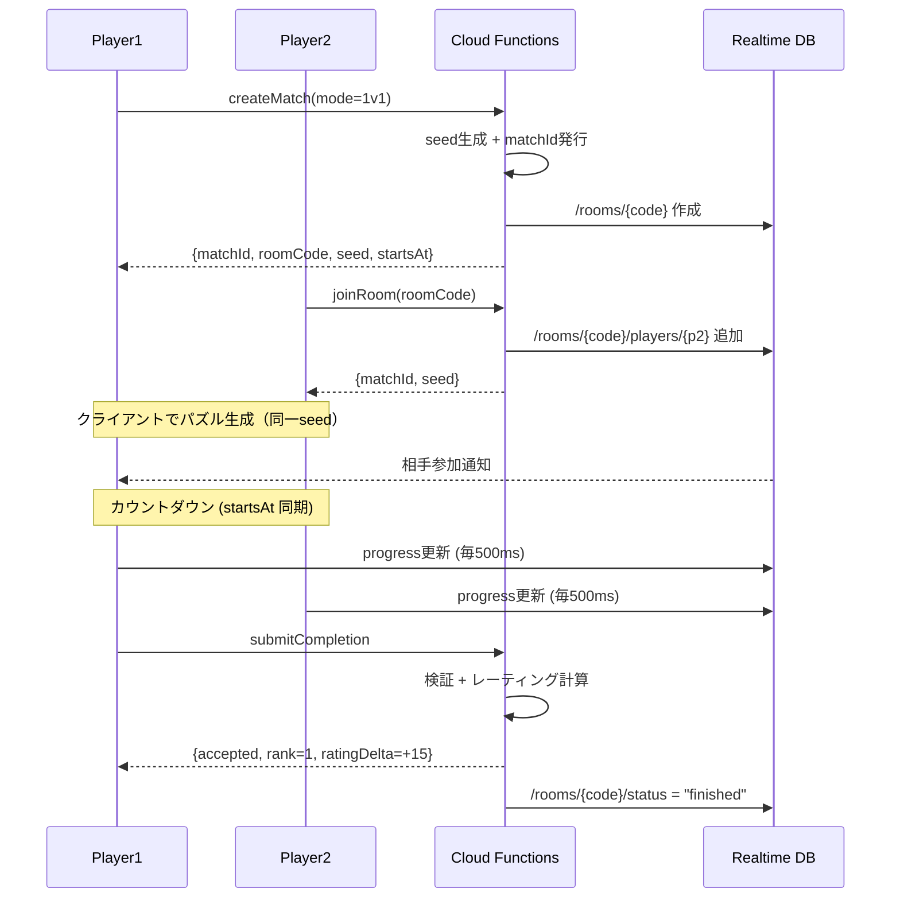

# ウボンゴ・インスパイア型 図形パズルゲーム
## 要件定義および基本設計書（SPECIFICATION.md）

| 項目 | 内容 |
|---|---|
| **Version** | 1.5 |
| **Last Updated** | 2026-05-10 |
| **Status** | Draft（基本設計フェーズ） |
| **保存先** | `docs/SPECIFICATION.md` |
| **本書の位置付け** | プロジェクトの「正（マスター）」。変更は必ずPRで議論する。 |

---

## 📑 目次

1. [プロダクト概要](#1-プロダクト概要)
2. [推奨技術スタック](#2-推奨技術スタック)
3. [画面構成・UI/UX 設計指針](#3-画面構成uiux-設計指針)
4. [ゲームシステム設計](#4-ゲームシステム設計)
5. [データモデル設計](#5-データモデル設計)
6. [API契約（Cloud Functions）](#6-api契約cloud-functions)
7. [ネットワーク回復性設計](#7-ネットワーク回復性設計)
8. [テスト戦略](#8-テスト戦略)
9. [国際化（i18n）と公開戦略](#9-国際化i18nと公開戦略)
10. [収益化モデル](#10-収益化モデル)
11. [デザインシステム](#11-デザインシステム)
12. [分析・KPI](#12-分析kpi)
13. [プロジェクト構造](#13-プロジェクト構造)
14. [エラーハンドリング方針](#14-エラーハンドリング方針)
15. [音響設計](#15-音響設計)
16. [アクセシビリティ詳細](#16-アクセシビリティ詳細)
17. [チュートリアル設計](#17-チュートリアル設計)
18. [エッジケース対応](#18-エッジケース対応)
19. [今後の開発ステップ](#19-今後の開発ステップ)
20. [Appendix](#appendix)

---

## 1. プロダクト概要

### 1.1 プロダクト名（仮称）
`PolyRush`（ポリラッシュ） ※開発中の仮称。リリース前に再検討。

### 1.2 ビジョン
ボードゲーム「ウボンゴ（Ubongo）」にインスパイアされた、**スピード × 思考 × 対戦**を融合した図形パズルゲーム。アナログボードゲームの「卓を囲む熱量」を、スマホ/タブレットの大画面UXで再現する。

### 1.3 コア体験（Core Loop）
1. ランダム生成された「枠（パズル盤）」が表示される
2. 与えられたポリオミノ（ブロック）を、回転・反転させて枠に隙間なく詰める
3. 制限時間内に完成させる、または対戦相手より早く完成させる
4. スコア・ランキング報酬を獲得し、次の問題へ

### 1.4 主要差別化要素
- **完全ランダム生成**：固定問題集を持たず、無限のリプレイ性を担保
- **マルチデバイス最適化**：スマホ片手操作と、タブレット両手操作の両方で快適なUX
- **オンライン対戦**：1v1〜1vN のリアルタイム同期対戦
- **ローカルAI対戦**：通信不要でいつでも遊べる

### 1.5 ターゲットユーザー
- **プライマリ**：パズル好きの10代〜40代（テトリス、Sudoku系プレイヤー）
- **セカンダリ**：家族・友人とのカジュアル対戦を求めるユーザー（タブレット家族プレイ）

### 1.6 プラットフォーム
- **第1弾**：Android（スマホ + タブレット）
- **将来拡張**：iOS、Web版（PWA）

### 1.7 開発戦略：「ソロ完成優先主義」🚩

> **本プロジェクトの最重要方針**：**ソロモード（1人用）を完全に作り込んでから、対戦機能の開発に着手する。**

#### 理由

1. **ゲームの核は「手触り」**：ブロックの操作感・スナップの気持ちよさ・パズルの難易度バランスが面白くなければ、対戦機能をいくら作っても土台が崩れる。
2. **ネットワークの複雑性を後回しにする**：通信同期・切断処理・不正対策は実装コストが極めて高い。土台が揺れている状態で重ねると、バグの切り分けが地獄化する。
3. **早期にユーザーフィードバックを得る**：ソロ版を v1.0 として Google Play に出すことで、対戦実装前に「そもそもこの操作感は受け入れられるか」を検証できる。
4. **挫折リスクの低減**：開発が長期化したときに「動くものが何もない」状態を回避する。

#### ソロ版「完成」の定義（Definition of Done）

以下を**全て満たすまで対戦実装に進まない**：

- [ ] 3難易度（Easy/Normal/Hard）すべてでパズル生成が安定（失敗率 1% 以下）
- [ ] スマホ・タブレット両方で 60fps 維持（実機検証済み）
- [ ] チュートリアルが完成し、初見プレイヤーが詰まらない
- [ ] 全ての操作（ドラッグ・回転・反転・スナップ）にSE + アニメ + ハプティクスが揃っている
- [ ] 設定画面・利き手モード・音量・モーション削減が機能
- [ ] アクセシビリティ要件を満たす（色覚UD、コントラスト、タッチ48dp+）
- [ ] エラーハンドリングが全画面で機能（クラッシュなく回復可能）
- [ ] 5名以上の実機ベータテストでクリティカルなUX問題が出ない
- [ ] **Google Play Store に v1.0 としてリリース済み**

これを満たした時点で、初めて Phase 4（CPU対戦）に進む。

---

## 2. 推奨技術スタック

> **選定方針**：「Claude Code との親和性 × 60fps の描画性能 × マルチデバイス対応 × 学習しやすさ」の4軸でバランスを最重視。

### 2.1 フロントエンド（クライアント）

| レイヤー | 採用技術 | 選定理由 |
|---|---|---|
| **アプリフレームワーク** | **Flutter 3.x**（Dart） | 単一コードベースで Android Phone / Tablet 両対応。`LayoutBuilder` + `MediaQuery` でアスペクト比対応が容易。Hot Reload で開発効率が極めて高い。 |
| **ゲーム描画エンジン** | **Flame Engine 1.x** | Flutter公式が認める2Dゲームエンジン。Canvas描画ベースで60fpsを出しやすい。コンポーネント設計（FCS）でブロック・グリッドを構造化しやすい。 |
| **状態管理** | **Riverpod 2.x** | Flutter現代標準。ゲーム状態とUI状態を分離しやすい。**初心者向け補足**：Provider/Bloc に近い概念で「アプリ全体で共有するデータの置き場所」を提供する仕組み。 |
| **ローカル保存** | **Isar 3.x** | Hiveの後継として開発元が推奨する高速NoSQL。型安全・クエリ可能。Hiveも動くが新規採用は Isar を選ぶ。 |
| **アニメーション** | Flame `EffectController` + Flutter `AnimationController` | スナップ・回転・反転の演出を細かく制御。`Curves.easeOutBack` 等で「気持ちよさ」を設計。 |
| **音響** | `flame_audio` | SE/BGMを軽量に再生。プリロード対応。 |
| **触覚** | `flutter/services` の `HapticFeedback` | スナップ時の振動フィードバック。 |

#### なぜ Flutter + Flame か（他案との比較）

| 候補 | 採用しなかった理由 |
|---|---|
| Unity (C#) | オーバースペック、APKサイズ大、Claude Code での自動補完が冗長になりやすい |
| React Native + Skia | ゲームループ処理で60fps維持が不安定、JSブリッジ層がボトルネック |
| Native Kotlin (Jetpack Compose) | 性能は最高だが iOS 展開不可（将来拡張性に欠ける）、開発工数が約2倍 |
| PWA (Capacitor) | 既存PWAスキル活用可だが、ドラッグ精度・60fps保証が困難 |

### 2.2 バックエンド

| レイヤー | 採用技術 | 役割 |
|---|---|---|
| **認証** | Firebase Authentication | 匿名認証 + Google SSO |
| **永続データ** | Cloud Firestore | ユーザープロファイル、ランキング、対戦履歴 |
| **リアルタイム同期** | Firebase Realtime Database | 対戦中の進捗・ルーム状態（低遅延が必須な箇所限定） |
| **サーバーロジック** | Cloud Functions for Firebase（TypeScript） | マッチメイキング、シード値発行、不正検証 |
| **エラー監視** | Firebase Crashlytics | クラッシュレポート |
| **解析** | Firebase Analytics | プレイ動向の把握 |

> **既存資産の活用**：井川さんが NALLA-PASS 2026 で培った Firebase / Firestore の append-only トランザクションログ設計は、本プロダクトの**対戦履歴・操作ログ**にそのまま応用可能です。

### 2.3 通信プロトコル

| シーン | プロトコル | 理由 |
|---|---|---|
| **1v1 対人対戦** | Firebase Realtime DB（Pub/Sub型） | 100ms以下の低遅延を担保。サーバー実装不要。 |
| **1vN グループ対戦** | Realtime DB + Firestore（ルーム管理） | ホスト権限はFirestoreで管理、進捗データのみRTDBへ。 |
| **CPU対戦** | ローカル（通信なし） | 完全オフライン動作。 |
| **将来拡張：超低遅延が必要な場合** | WebRTC DataChannel（P2P） | 直接通信でレイテンシ最小化。シグナリングのみFirebase経由。 |

### 2.4 開発環境・CI/CD

| 項目 | 採用 |
|---|---|
| バージョン管理 | GitHub |
| AIペアプログラミング | **Claude Code Web（claude.ai/code、主・実装＆Git操作）** + Claude（厳格レビュー）+ Gemini（UI/実装提案）+ ChatGPT（タスク分解・進行管理） |
| 開発環境 | **Claude Code Web のクラウドVM**（4 vCPU / 16GB RAM / 30GB Disk）。ローカル環境構築・ターミナル操作は不要。 |
| Flutter SDK | クラウドVM上に Setup script で導入（環境キャッシュにより2回目以降は高速起動） |
| CI | GitHub Actions（lint, test, APK build） |
| 配信（テスト） | Firebase App Distribution |
| 配信（本番） | Google Play Store |

> **開発フローの大原則**：実装・コミット・PR作成はすべて Claude Code Web に自然言語で依頼する。井川さんはブラウザでのレビュー・マージ・GitHub設定のみを行う。コマンドラインの知識は不要。

---

## 3. 画面構成・UI/UX 設計指針

### 3.1 画面一覧

| # | 画面名 | 概要 |
|---|---|---|
| 1 | スプラッシュ | ロゴ表示 + アセットプリロード |
| 2 | ホーム | モード選択（ソロ / CPU対戦 / オンライン対戦） |
| 3 | 難易度選択 | Easy / Normal / Hard |
| 4 | マッチング・ロビー | オンライン対戦時のルーム作成・参加 |
| 5 | **ゲームプレイ画面（コア）** | パズル本体 |
| 6 | リザルト | スコア・順位・ベストタイム |
| 7 | 設定 | 音量、操作感度、利き手モード |
| 8 | ランキング | 全国 / フレンド |

### 3.2 レイアウト指針：スマホ版（Portrait主、16:9〜21:9）

```
┌─────────────────┐
│ [タイマー][相手進捗]  │  ← 上部HUD（ステータス）
├─────────────────┤
│                 │
│   パズル枠       │  ← 画面の上部 約60%
│   (Grid)        │
│                 │
├─────────────────┤
│ [Block][Block]  │  ← ピース置き場（下部 約40%）
│ [Block][Block]  │     親指の操作圏内に集約
└─────────────────┘
```

- **片手操作前提**：重要操作（ブロック選択・回転・反転）は画面下半分に集約。
- **アスペクト比 21:9（縦長端末）対応**：上下の余白は「広告非表示時の戦績ティッカー」として活用。
- ピース置き場は横スクロール可能（ブロックが多いHard用）。

### 3.3 レイアウト指針：タブレット版（Landscape主、4:3〜16:10）

```
┌──────────────────────────────────────┐
│ [タイマー]                            │
├──────────────────┬───────────────────┤
│                  │ ▼相手1進捗          │
│                  │  [████░░] 60%      │
│   パズル枠        │ ▼相手2進捗          │
│   (Grid大)       │  [██░░░░] 30%      │
│                  ├───────────────────┤
│                  │ [Block][Block]     │
│                  │ [Block][Block]     │
└──────────────────┴───────────────────┘
```

- **左にパズル、右に「相手進捗 + ピース置き場」を並列配置**。
- 単純な拡大ではなく、`LayoutBuilder` で `constraints.maxWidth >= 600px` をブレークポイントに**完全に別レイアウト**を構築。
- 1v1 では右上に相手の進捗とアバターを大きく表示し、対戦の臨場感を演出。

### 3.4 操作感（タッチUX）— 最重要設計

#### 3.4.1 Hitbox（タッチ判定）拡張
- 描画サイズが 1マス=80px の場合、Hitbox は**縦横+16pxずつ拡張**（実効120px相当）。
- ブロック同士が密集している場合は、最も近い中心からの距離で判定。
- 実装：Flame の `HitboxComponent` のサイズを描画コンポーネントより大きく設定。

#### 3.4.2 Finger Offset（指の死角への配慮）
- ドラッグ開始時、ブロック描画位置を**指の接触点から上方向に 40〜60px オフセット**。
- ピックアップ時は 100ms かけてスムーズに浮かび上がる（`Curves.easeOut`）。
- リリース時は 150ms かけて自然に着地。

#### 3.4.3 スナップ（吸着）
- グリッドの最寄りマス中心から**半マス以内**に来たら自動吸着。
- 吸着発生時の3点フィードバック：
  - **視覚**：ブロックが軽く弾むアニメ（spring物理、damping 0.7）
  - **聴覚**：`snap.wav`（80ms程度の短いSE）
  - **触覚**：`HapticFeedback.lightImpact()`

#### 3.4.4 回転・反転
- ブロック選択時、画面下部に専用ボタン（回転90°、水平反転）を表示。
- ボタン押下時：300ms の回転アニメ + `rotate.wav` 再生。
- アニメ中もタッチ操作はキューイングし、応答性を保つ。

### 3.5 パフォーマンス設計指針

| 項目 | 目標値 | 担保方法 |
|---|---|---|
| フレームレート | **60fps を必達／90・120Hz端末では追従**（高リフレッシュレート対応） | Flame `Component` のtick最小化、`RepaintBoundary` 活用、`AndroidManifest.xml` で `preferredDisplayModeId` 設定 |
| 入力→描画反映の体感遅延 | **< 50ms**（Android OS層レイテンシ込みの現実値） | `pointerEvents` を直接Canvas層で受け、`AnimationController` を介さず即時描画 |
| 起動時間 | < 2秒（コールドスタート） | 遅延初期化、SE/画像のpreloadを非同期化 |
| 描画オーバードロー | 1.5x以下 | Flutter DevTools Performance Overlay で常時監視 |
| APKサイズ | < 50MB | アセット圧縮、不要パッケージ排除、App Bundle 配信 |

> **補足**：「タッチから描画反映 < 16ms」と書かれた仕様書をたまに見るが、Android では OS 層の入力遅延だけで 30-50ms あるため非現実的。**体感**を50ms以下にするのが実用目標。

### 3.6 アクセシビリティ

- 色覚多様性対応：ブロック色は**明度差でも区別可能**な配色（カラーユニバーサルデザイン準拠）。
- フォントサイズ：システム設定の文字サイズに追従。
- 利き手モード：左利きの場合、回転・反転ボタンを左側に配置。

---

## 4. ゲームシステム設計

### 4.1 ゲームモード詳細

#### 4.1.1 ソロモード（タイムアタック）
- 1人プレイ。難易度を選択し、何問解けるかを競う or ベストタイム更新を狙う。
- 記録：ベストタイム、平均タイム、連続成功数。

#### 4.1.2 CPU対戦：1v1 / 1v2
- CPUは**「人間らしい思考時間」を再現**。内部の最適解探索は即座に終わるが、配置までに意図的な遅延を入れる。
  - **Easy CPU**：1手につき 1.5〜3.0秒の遅延、30%の確率で「悪手→剥がす」演出
  - **Normal CPU**：0.8〜1.5秒の遅延、最適解で配置
  - **Hard CPU**：0.3〜0.8秒の遅延、容赦なく最適解
- 1v2 は CPU2体を別 Isolate（ワーカースレッド）で並行動作させ、UIをブロックしない。

#### 4.1.3 対人対戦：1v1（リアルタイム同期）
- マッチメイキング → ルーム生成 → カウントダウン → 同時スタート。
- **同期データ**：相手の進捗％（`配置済みマス数 / 全マス数`）のみ。
  - 完成形は同期しない（カンニング防止 + 通信量削減）。
- **結果判定**：先に「全マス埋まった」状態を Cloud Functions が検証。

#### 4.1.4 グループ対戦：1vN（ルームホスト制）
- ホストがルームを作成 → 6桁のルームコードを共有。
- 全員が**同じシード値**で同じパズルを生成（後述）。
- タイムアタック形式、完成順にランキング表示。
- 最大プレイヤー数：8人（仮、負荷検証で調整）。

### 4.2 状態管理アーキテクチャ

#### 4.2.1 状態の階層構造

```
AppState (Riverpod ProviderScope)
├── AuthState              : ユーザー情報・認証トークン
├── GameSessionState       : 現在のゲームセッション
│   ├── PuzzleState        : 枠データ + ブロック群
│   ├── PlayerActionState  : ドラッグ中のブロック等
│   └── TimerState         : 経過時間
└── NetworkState           : ルーム状態、相手進捗
```

#### 4.2.2 ゲームセッションの状態遷移



### 4.2.3 Append-only 操作ログ（NALLA-PASS方式の応用）

**すべての操作（ブロック移動・回転・反転・配置）をイベントログとして追記**します。
- ローカルでは Hive にバッファリング、対戦終了後に Firestore へ送信。
- 用途：リプレイ機能、不正検証、デバッグ、QA改善。

```jsonc
// イベントログ例
{ "t": 1234, "type": "block_pickup",  "blockId": "B2" }
{ "t": 1389, "type": "block_rotate",  "blockId": "B2", "rot": 90 }
{ "t": 1456, "type": "block_place",   "blockId": "B2", "x": 3, "y": 2 }
{ "t": 1502, "type": "puzzle_complete" }
```

### 4.3 パズル自動生成アルゴリズム

> **方針**：「**逆算生成法**（Reverse Construction）を主軸とし、**バックトラッキング検証**で品質を保証する」

> **🔑 重要な設計決定**：本ゲームの**「枠」は矩形ではなく不規則なポリオミノ形状**とする（本物のウボンゴと同じ）。これにより、「ブロックを敷き詰めた後の和集合 = 枠」と定義でき、隙間問題が原理的に発生しない。

#### 4.3.1 ステップ1：ポリオミノ・プールの定義

| 難易度 | ブロック数 | 各ブロックのセル数 | 合計セル数（=枠の面積） |
|---|---|---|---|
| Easy | 3個 | 3〜4 | 9〜12 |
| Normal | 4個 | 4〜5 | 16〜20 |
| Hard | 5個 | 4〜5 | 20〜25 |

事前に「Free Polyomino（回転・反転で同一視）」のセットを定数として保持：
- **トロミノ**（3セル）：2種
- **テトロミノ**（4セル）：5種
- **ペントミノ**（5セル）：12種

#### 4.3.2 ステップ2：逆算生成法による「枠」の構築

```
Algorithm: ConstructFrame(difficulty, seed)
1. seed で乱数生成器を初期化
2. 難易度に応じてブロック個数 N を決定
3. 仮想無限グリッド上に最初の1個目のブロックを原点付近に置く
4. for i = 2 to N:
     a. プールからランダムにポリオミノを1つ選ぶ
     b. ランダムに回転・反転を適用
     c. 「既配置ブロック群と1辺以上接する」かつ「重ならない」位置を全列挙
     d. 候補の中からランダムに1つ選んで配置
     e. 候補が0なら、ステップ a からやり直す（最大10回）
5. 配置したブロック群の和集合（連結したマスの集合）を「枠」として返す
6. 枠の外接矩形を別途記録（描画範囲決定用）
```

**この設計のポイント**：
- 枠は**ブロック配置の結果として定義される**ため、隙間が発生しない
- 矩形に収まらない不規則な枠形状になる（ウボンゴらしさ）
- 計算量が軽い：失敗が少ないため再試行コスト最小
- シード値を共有すれば全クライアントで同じ問題を生成可能

#### 4.3.3 ステップ3：バックトラッキングによる「解の妥当性」検証

逆算で作った問題でも、**別解が多すぎると面白くない**ため、解の数を数えます。

```
Algorithm: CountSolutions(frame, blocks, limit=4)
1. 空きマスのうち、最も左上のマス (x, y) を探す
2. 残りブロックがなく空きもなければ → solutionCount++
3. 各ブロック（同じ形は1度だけ試す＝マルチセット対応）×
   各回転反転バリアントを試す:
     a. (x, y) を起点として置けるか判定
     b. 置けるなら配置 → 再帰呼び出し → 戻ってきたら剥がす
4. solutionCount >= limit になったら早期return
5. solutionCount を返す
```

> **マルチセット対応**：同形のブロックが複数ある場合、配置順を区別すると同じ解が重複カウントされる。同形ブロックは「使用済み個数」で管理する。

| 解の数 | 判定 |
|---|---|
| 1〜3通り | 採用（適度な閃きの余地がある良問） |
| 4通り以上 | 簡単すぎ → 再生成 |
| 0通り | バグ → 再生成 + ログ記録 |

#### 4.3.4 シード値による問題の同期

- マッチング時、Cloud Functions が `seed = uuid().substring(0, 8)` を発行。
- 全プレイヤーが同じシードで同じ問題を生成。
- 生成結果のキャッシュ：`seed → 盤面ハッシュ` を LRU で保持し、再生成コスト削減。

### 4.4 CPU の思考アルゴリズム

- **同じバックトラッキングソルバを使用**し、最適解を求める。
- 思考時間の調整は前述（4.1.2参照）。
- **重要**：CPUの思考は別 Isolate（Dartワーカースレッド）で実行し、UIを絶対にブロックしない。

### 4.5 不正対策（オンライン対戦）

- クライアントから送られる「進捗％」と「完了通知」は、Cloud Functions で再計算検証。
- 操作ログを Firestore に保存し、異常な速さの完成は事後にBAN対象とする。
- シード値はサーバー発行のため、クライアント改竄不可。

### 4.6 レーティング（ELO方式）

対人対戦の結果はELOレーティングで管理する。

**計算式**：

```
新レーティング = 現レーティング + K × (実結果 - 期待勝率)

期待勝率 E = 1 / (1 + 10^((相手レーティング - 自分レーティング) / 400))
実結果   S = 1.0（勝ち）/ 0.5（引き分け）/ 0.0（負け）

K値（変動の大きさ）:
  - 初心者（30戦未満）: K=32
  - 通常: K=16
  - 上級者（レーティング2000+）: K=10
```

**初期値**：1000
**1vN**：完成順位に応じて段階的にスコア化（1位+15, 2位+5, 3位-5, ...）
**不正検出時**：レーティング変動を無効化、対戦相手も影響を受けない

### 4.7 アバター生成

- `avatarSeed`（文字列）から決定論的に色・形を生成
- ライブラリ：`flutter_avatar` 相当を自前実装、または DiceBear 互換
- ユーザー写真アップロードはリリース当初は不採用（モデレーションコスト回避）

---

## 5. データモデル設計

### 5.1 Firestore（永続データ）

```
/users/{userId}
  ├─ displayName: string
  ├─ avatarSeed: string             // アバター生成用
  ├─ createdAt: timestamp
  ├─ stats: {
  │    totalGames: number,
  │    wins: number,
  │    bestTimeEasy: number,
  │    bestTimeNormal: number,
  │    bestTimeHard: number,
  │    rating: number               // ELO 的なレーティング、初期値1000
  │  }
  └─ settings: { lefty: bool, hapticLevel: number, ... }

/matches/{matchId}                  // 対戦履歴（append-only）
  ├─ mode: "1v1" | "1v2" | "1vN"
  ├─ difficulty: "easy" | "normal" | "hard"
  ├─ seed: string
  ├─ players: [userId]
  ├─ winnerId: userId | null
  ├─ startedAt: timestamp
  ├─ endedAt: timestamp
  └─ /events/{eventId}              // 操作ログ（NALLA-PASS方式）
       ├─ playerId, t, type, payload

/leaderboards/{difficulty}/scores/{userId}
  ├─ bestTime: number
  ├─ updatedAt: timestamp
```

### 5.2 Realtime Database（リアルタイム同期、低遅延が必要な分のみ）

```
/rooms/{roomCode}
  ├─ status: "waiting" | "countdown" | "playing" | "finished"
  ├─ hostId: string
  ├─ seed: string
  ├─ difficulty: string
  ├─ startsAt: timestamp           // サーバー時刻でカウントダウン同期
  └─ /players/{playerId}
       ├─ displayName: string
       ├─ progress: number          // 0.0〜1.0
       ├─ finishedAt: timestamp | null
       └─ lastPing: timestamp       // 切断検知用、5秒ごと更新
```

### 5.3 ローカル（Isar）

```
@collection
class GameLog {
  Id id;
  String matchId;
  int timestamp;
  String eventType;
  String payloadJson;
}

@collection
class UserSettings {
  Id id = 0;                        // singleton
  bool lefty;
  double hapticLevel;
  double bgmVolume;
  double seVolume;
  String localeOverride;            // null = システム言語
}
```

---

## 6. API契約（Cloud Functions）

すべて TypeScript / HTTPS Callable で実装。

### 6.1 `createMatch`

**用途**：マッチメイキングまたはルーム作成。

```typescript
// Request
{
  mode: "1v1" | "1v2" | "1vN",
  difficulty: "easy" | "normal" | "hard",
  isPrivate: boolean    // true ならルームコード生成のみ
}

// Response
{
  matchId: string,
  roomCode: string,     // 6桁の英数字
  seed: string,         // パズル生成用シード
  expectedStartAt: number  // Unix ms、3秒後のサーバー時刻
}
```

### 6.2 `joinRoom`

```typescript
// Request
{ roomCode: string }

// Response
{ matchId: string, seed: string, players: PlayerInfo[] }
```

### 6.3 `submitCompletion`

**用途**：プレイヤーが完成したと申告。サーバー側で再検証する。

```typescript
// Request
{
  matchId: string,
  finalState: BlockPlacement[],     // 最終配置
  eventLog: GameEvent[]              // 全操作ログ（不正検証用）
}

// Response
{
  accepted: boolean,
  serverFinishTime: number,
  rank: number | null,               // 1=1着
  ratingDelta: number                // ±レーティング変動
}
```

### 6.4 `reportPlayer`

```typescript
{ matchId: string, targetUserId: string, reason: string }
```

### 6.5 マッチメイキングのシーケンス



---

## 7. ネットワーク回復性設計

### 7.1 切断検知

- クライアントは5秒ごとに `lastPing` を Realtime DB に書き込み。
- サーバー（Cloud Functions スケジューラ）が30秒以上無更新のプレイヤーを「切断扱い」にする。
- 残ったプレイヤーには「○○さんが切断しました」とトーストで通知。

### 7.2 再接続

- アプリ復帰時、ローカルの `matchId` を読み、サーバーに状態問合せ。
- 60秒以内の再接続なら復帰可能（操作ログから状態復元）。
- 60秒超過なら不戦敗扱い（レーティング微減）。

### 7.3 ラグ補償

- 進捗％の表示は受信値ではなく、過去2サンプルから**線形補間**して滑らかに見せる。
- カウントダウン開始時刻は**サーバー時刻基準**で全員同期（NTP的な処理）。

### 7.4 オフライン対応

- ソロモード・CPU対戦は完全オフラインで動作。
- オンライン対戦中に通信が落ちた場合は「通信を確認しています…」を3秒表示後、ステータス更新。

---

## 8. テスト戦略

| テスト種別 | 対象 | ツール | カバー率目標 |
|---|---|---|---|
| ユニットテスト | パズル生成、ソルバ、状態管理 | `flutter_test` | 80%+ |
| ウィジェットテスト | 画面遷移、ボタン動作 | `flutter_test` | 主要画面100% |
| ゴールデンテスト | レイアウト崩れ検知（Phone/Tablet両方） | `golden_toolkit` | 主要画面100% |
| 統合テスト（E2E） | ソロプレイ完走、マッチング成立 | `integration_test` | クリティカルパス |
| 性能テスト | 60fps維持、起動時間 | Flutter DevTools + 手動 | 主要シナリオ |
| 負荷テスト | Cloud Functions 同時接続 | Firebase Local Emulator + k6 | 100同時接続まで |
| ベータテスト | 実機での総合UX | Firebase App Distribution | 5名以上 |

**CI上での自動実行**：
- PR作成時：ユニット + ウィジェット + ゴールデン
- main ブランチマージ時：全テスト + APKビルド + Firebase App Distribution 配信

---

## 9. 国際化（i18n）と公開戦略

### 9.1 対応言語（リリース時）

| 優先度 | 言語 | 理由 |
|---|---|---|
| 1 | 日本語 | 主要マーケット |
| 1 | 英語 | Google Play 公開の事実上の必須言語 |
| 2 | 中国語（簡体・繁体） | アジア展開 |
| 2 | 韓国語 | アジア展開 |

### 9.2 実装方針

- Flutter 公式の `flutter_localizations` + ARB ファイル方式。
- 文言は**すべて ARB に外出し**、コード内ハードコード禁止（Lintで強制）。
- 日付・数値・時間表記は `intl` パッケージで自動切替。

### 9.3 ストア掲載情報の多言語化

- スクリーンショット、説明文、プライバシーポリシーをすべて日英対応。
- アプリアイコンは言語非依存のシンボルベース。

### 9.4 法的対応

- **プライバシーポリシー必須項目**：取得情報、利用目的、第三者提供、保管期間、問合せ先
- **GDPR 配慮**：EU圏ユーザー向けの同意ダイアログ（後続フェーズ）
- **COPPA 配慮**：13歳未満を対象としないことを明記、または対応する
- 特定商取引法表記は不要（無料アプリ + 課金は Google Play 経由のため）

---

## 10. 収益化モデル

### 10.1 リリース時（フリーミアム）

| 要素 | 内容 |
|---|---|
| **基本プレイ** | 完全無料 |
| **広告** | リザルト画面後にインタースティシャル（5戦に1回）、ホーム下部にバナー |
| **広告除去** | 600円買い切り（IAP） |
| **将来：プレミアム** | 月額480円：限定スキン、詳細統計、広告非表示 |

### 10.2 SDK選定

- **広告**：Google AdMob（mediation 後追加検討）
- **IAP**：`in_app_purchase` 公式パッケージ
- **収益分析**：Firebase Analytics + AdMob連携

### 10.3 倫理的配慮

- 子ども向け広告は除外（AdMob設定で対応）
- ガチャ・ルートボックス的要素は採用しない
- 過度なプッシュ通知をしない（最大週1回）

---

## 11. デザインシステム

### 11.1 カラーパレット（仮）

| 用途 | カラー | コード |
|---|---|---|
| Primary（ブランド） | Indigo 600 | `#4F46E5` |
| Accent（決定・成功） | Emerald 500 | `#10B981` |
| Warning（警告） | Amber 500 | `#F59E0B` |
| Danger（失敗） | Rose 500 | `#F43F5E` |
| Background（背景） | Slate 50 / Slate 900 | `#F8FAFC` / `#0F172A` |

ブロック色は**6色＋明度差**で12種を区別（カラーユニバーサルデザイン準拠）。

### 11.2 タイポグラフィ

| ロール | フォント | サイズ |
|---|---|---|
| Display（タイマー等） | M PLUS 1p Bold | 48-72sp |
| Heading | Noto Sans JP Bold | 24-32sp |
| Body | Noto Sans JP Regular | 14-16sp |
| Caption | Noto Sans JP Regular | 12sp |

### 11.3 スペーシング

8pxグリッドベース：`4, 8, 12, 16, 24, 32, 48, 64`

### 11.4 アニメーション原則

| 用途 | Duration | Curve |
|---|---|---|
| マイクロ（ボタン押下） | 100ms | `easeOut` |
| 状態変化（ピックアップ） | 150-300ms | `easeOutBack` |
| 画面遷移 | 300-400ms | `easeInOutCubic` |
| 強調（成功演出） | 600-800ms | `elasticOut` |

### 11.5 ダーク/ライトモード

- システム設定追従（デフォルト）
- 設定画面で個別切替可

---

## 12. 分析・KPI

### 12.1 主要KPI

| KPI | 目標値 | 計測方法 |
|---|---|---|
| D1 リテンション | 40%+ | Firebase Analytics |
| D7 リテンション | 15%+ | Firebase Analytics |
| 1セッションあたりプレイ問題数 | 3問+ | カスタムイベント |
| クラッシュフリー率 | 99.5%+ | Crashlytics |
| 平均FPS | 58fps+ | Performance Monitoring |

### 12.2 計測すべきカスタムイベント

```
- app_open
- mode_selected           { mode, difficulty }
- puzzle_generated        { seed, generationTimeMs }
- puzzle_completed        { difficulty, durationMs, blocksMoved }
- puzzle_abandoned        { difficulty, progressPct }
- match_joined            { mode, isHost }
- match_disconnected      { mode, durationMs }
- iap_purchased           { productId, price }
- ad_viewed               { adType, screen }
```

### 12.3 ダッシュボード

- Firebase Console + Looker Studio 連携
- 週次レビュー：井川さんの既存「多AI体制」でデータ分析（Geminiでグラフ生成、Claudeで考察）

---

## 13. プロジェクト構造

### 13.1 リポジトリ構成

```
polyrush/
├── .github/
│   └── workflows/
│       ├── ci.yml                  # PR時：lint + test
│       └── release.yml             # main時：APKビルド + 配信
├── android/                        # Android固有設定
├── docs/
│   ├── SPECIFICATION.md            # 本書
│   ├── CHANGELOG.md
│   └── adr/                        # 設計判断の記録（Architecture Decision Records）
├── lib/
│   ├── main.dart
│   ├── app.dart                    # アプリエントリ・Theme設定
│   ├── core/                       # 共通基盤
│   │   ├── constants.dart
│   │   ├── result.dart             # Result<T, E> 型（エラーハンドリング）
│   │   └── logger.dart
│   ├── data/                       # データアクセス層
│   │   ├── firestore/
│   │   ├── rtdb/
│   │   ├── isar/
│   │   └── models/
│   ├── domain/                     # ドメインロジック（純粋Dart）
│   │   ├── puzzle/
│   │   │   ├── polyomino.dart
│   │   │   ├── generator.dart
│   │   │   └── solver.dart
│   │   ├── game/
│   │   │   └── game_state.dart
│   │   └── matchmaking/
│   ├── game/                       # Flame コンポーネント
│   │   ├── game_world.dart
│   │   ├── components/
│   │   │   ├── grid_component.dart
│   │   │   ├── block_component.dart
│   │   │   └── hud_component.dart
│   │   └── effects/
│   ├── ui/                         # Flutter Widget層
│   │   ├── screens/
│   │   │   ├── home/
│   │   │   ├── play/
│   │   │   ├── result/
│   │   │   └── settings/
│   │   ├── widgets/                # 再利用可能ウィジェット
│   │   └── theme/                  # ColorScheme, TextTheme
│   ├── network/                    # 通信層
│   │   ├── room_service.dart
│   │   └── sync_service.dart
│   └── l10n/                       # 多言語ARB
│       ├── app_ja.arb
│       └── app_en.arb
├── test/
│   ├── unit/
│   ├── widget/
│   └── golden/
├── integration_test/
├── functions/                      # Cloud Functions (TypeScript)
│   ├── src/
│   │   ├── createMatch.ts
│   │   ├── joinRoom.ts
│   │   └── submitCompletion.ts
│   └── package.json
├── assets/
│   ├── audio/
│   │   ├── bgm/
│   │   └── se/
│   └── images/
├── pubspec.yaml
└── README.md
```

### 13.2 レイヤー責任分離（クリーンアーキテクチャ風）

```
┌─────────────────────────────────────┐
│  ui/  +  game/                       │ ← 表示・入力
├─────────────────────────────────────┤
│  domain/                             │ ← ビジネスロジック（純粋Dart、Flutterに依存しない）
├─────────────────────────────────────┤
│  data/  +  network/                  │ ← 外部I/O
└─────────────────────────────────────┘
```

**初心者向け補足**：上の層は下の層を呼ぶが、下の層は上の層を呼ばない。これにより `domain/` 単体でテスト可能になり、テスト速度・安定性が向上する。

---

## 14. エラーハンドリング方針

### 14.1 エラー分類と対処

| 分類 | 例 | 対処 |
|---|---|---|
| **回復可能・想定内** | ネットワーク一時切断、Firestore書込競合 | リトライ（指数バックオフ）、自動回復、ユーザーには軽通知 |
| **回復可能・要操作** | 認証期限切れ、ルームコード期限切れ | ダイアログで再操作を促す |
| **回復不能・致命** | 必須権限拒否、ストレージ枯渇 | エラー画面 + ホームへ誘導 |
| **プログラミングエラー** | null参照、型不整合 | Crashlyticsへ送信 + ユーザーには汎用エラー表示 |

### 14.2 `Result<T, E>` 型の採用

例外を投げる代わりに、データ層・ドメイン層では `Result` 型で成否を返す。

```dart
sealed class Result<T, E> {
  const Result();
}
class Ok<T, E> extends Result<T, E> { final T value; }
class Err<T, E> extends Result<T, E> { final E error; }
```

**メリット**：例外の見落としがなくなり、コンパイラが処理を強制する。

### 14.3 ユーザーへの提示

- 専門用語禁止：「ネットワーク接続を確認してください」OK、「Socket timeout exception」NG
- 復帰アクションを必ず1つ以上提示（再試行・戻る・連絡）
- スナックバー（軽通知）/ダイアログ（要操作）/フルスクリーンエラー（致命）を使い分ける

### 14.4 ログ収集

- 重要度：DEBUG / INFO / WARN / ERROR / FATAL
- WARN 以上を Crashlytics に送信
- 個人情報は絶対にログに含めない（PII Lint で機械的に検出）

---

## 15. 音響設計

### 15.1 設計哲学

- **「音で勝てる」ゲームを目指す**：操作の手応えはSEで決まる。8割は音で決まると考える。
- **無音でも遊べる**：ミュートしても情報量が減らないこと（視覚で完結する）。
- **ミキシング基準**：BGM -18dBFS、SE -12dBFS（SEを目立たせる）

### 15.2 SE一覧

| ID | ファイル | 長さ | 用途 |
|---|---|---|---|
| `se_block_pickup` | `pickup.wav` | 80ms | ブロックを持ち上げ |
| `se_block_rotate` | `rotate.wav` | 120ms | 回転 |
| `se_block_flip` | `flip.wav` | 120ms | 反転 |
| `se_block_snap` | `snap.wav` | 80ms | グリッド吸着 |
| `se_block_invalid` | `error.wav` | 200ms | 配置不可 |
| `se_puzzle_complete` | `complete.wav` | 1.5s | 完成ファンファーレ |
| `se_match_start` | `start.wav` | 1.0s | 対戦スタート |
| `se_countdown` | `tick.wav` | 80ms | カウントダウン |

### 15.3 BGM

| シーン | 曲調 | BPM |
|---|---|---|
| ホーム | 軽快・期待感 | 110-120 |
| プレイ中（ソロ） | 集中・落ち着き | 90-100 |
| プレイ中（対戦） | 緊迫・推進力 | 130-140 |
| 残り10秒 | 緊張ピーク（既存BGMにフィルターをかける） | - |
| リザルト | 達成感・余韻 | 80-90 |

### 15.4 ユーザー設定との連動

- BGM音量、SE音量を独立スライダーで提供
- ミュートボタンはホーム右上に常時配置
- システム音量と独立（マナーモードでも鳴らせる選択肢）

---

## 16. アクセシビリティ詳細

### 16.1 視覚

- **色覚多様性**：ブロックは色＋**形状内部のパターン（ドット、ストライプ等）**で区別
- **コントラスト**：WCAG AA基準（テキスト 4.5:1 以上）
- **フォントサイズ追従**：システム設定の「文字サイズ：大」までは破綻しない
- **モーション削減**：OSの「視差効果を減らす」設定を尊重し、回転アニメ等を短縮/省略

### 16.2 操作

- **大きなタッチターゲット**：最小48dp（Material Design 推奨）
- **ハプティクスON/OFF**
- **利き手モード**：UI要素を左右反転
- **長押し代替操作**：ダブルタップでも回転できるオプション

### 16.3 聴覚

- 音情報は必ず視覚情報と冗長化（吸着SE→吸着アニメも同時発生）
- 字幕オプション（チュートリアル動画用）

### 16.4 スクリーンリーダー対応

- 主要画面はスクリーンリーダーでナビ可能（`Semantics` ウィジェット）
- ただし**ゲームプレイ画面はリアルタイム性重視のため対象外**（その旨を設定で明記）

---

## 17. チュートリアル設計

### 17.1 構成

| ステップ | 内容 | スキップ可 |
|---|---|---|
| 1 | ようこそ画面（アニメ付きキャラ紹介） | ✕ |
| 2 | ブロックをドラッグして枠に置く | ✕（実操作必須） |
| 3 | 回転・反転ボタンの紹介 | ✕（実操作必須） |
| 4 | スナップを体験 | ✕（実操作必須） |
| 5 | タイマー説明（時間内に完成） | ✓ |
| 6 | モード選択画面の説明 | ✓ |
| 7 | 完了：報酬と「フリープレイへ」 | ✕ |

### 17.2 設計原則

- 1画面1メッセージ（情報過多を避ける）
- 「読ませる」より「やらせる」（インタラクション必須のステップを混ぜる）
- 進捗を表示（◯/7）
- いつでも設定からやり直せる

### 17.3 表示タイミング

- 初回起動時に強制
- 「ホーム→ヘルプ→チュートリアル再生」で再アクセス可能
- 機能追加時はホームに「NEW」バッジで誘導

---

## 18. エッジケース対応

### 18.1 ゲーム内

| ケース | 対応 |
|---|---|
| 完全に同時に完成（ms単位タイ） | サーバー受信時刻で先着決定。引き分けとはしない |
| 全員時間切れ | 最も進捗％が高い人が勝利、同率なら引き分け |
| 1人だけ残してホスト退出 | ルーム継続（自動でホスト権限委譲） |
| 全員退出 | ルーム削除（30秒猶予後） |
| 同一人物が複数端末で同じルームに入る | 後発を拒否（uid単位で判定） |

### 18.2 アプリ状態

| ケース | 対応 |
|---|---|
| 対戦中にバックグラウンド復帰 | タイマーは進み続ける（=ペナルティあり）、状態は復元 |
| 対戦中にメモリ不足でキル | 60秒以内の再起動で復帰可能 |
| 対戦中に着信 | 操作はその間止まるが、相手のタイマーは進む |
| 対戦中に画面回転 | 対戦中は回転ロック |
| 端末時刻が大幅にズレている | サーバー時刻基準で動作、クライアント時刻は無視 |
| ストレージ容量不足 | ログ送信は諦めるが、プレイは継続可能 |

### 18.3 ネットワーク

| ケース | 対応 |
|---|---|
| 通信が断続的に切れる | 進捗送信は queue に積み、復帰時にバルク送信 |
| 通信品質が悪く進捗反映が遅い | ローカル UI は楽観的更新、サーバー確定で巻き戻る場合は控えめなアニメで補正 |
| Firebase が完全停止 | エラーダイアログ「サーバーに接続できません」+ ソロモードへの誘導 |

### 18.4 不正・悪用

| ケース | 対応 |
|---|---|
| 異常に速い完成（人類最速を超える） | サーバー側で却下、レーティング無効化、要観察フラグ |
| ルームコード総当たり攻撃 | レート制限（1分10回まで）、6桁全32^6パターンで充分稀少 |
| 不適切なdisplayName | NGワードフィルタ、通報機能 |

---

## 19. 今後の開発ステップ

> **進め方**：実装は **Claude Code Web** に依頼し、PRが作成されたらブラウザでレビュー・マージする。重要な設計判断や PR レビューは Claude（チャット版）に厳格チェックを依頼する。フェーズ間で必ず Pull Request を分け、各フェーズの最後に「動くデモ」を作る。

> **🚩 大原則（再掲）**：本ロードマップは「**ソロ完成優先主義**」（Section 1.7）に基づき、Phase 0〜3.5（ソロ版v1.0リリース）までを**ステージ1**、Phase 4〜7（対戦実装）を**ステージ2**として明確に分離している。**ステージ1のDoDを満たすまでステージ2には絶対に進まない。**

### 全体ロードマップ

```
┌─── ステージ1：ソロ版完成（合計 約11週間）─────────────┐
│  Phase 0:   セットアップ              (1週)          │
│  Phase 1:   パズル生成エンジン         (2週)          │
│  Phase 2:   ソロプレイ MVP             (3週)          │
│  Phase 3:   ソロ完成度向上             (4週)          │
│    3a) レスポンシブ・設定                            │
│    3b) チュートリアル・サウンド・A11y                 │
│    3c) ベータテスト・最終調整                         │
│  Phase 3.5: 🚀 ソロ版v1.0 ストア公開    (1週)         │
│  ──── DoD チェック ──── 通過しなければステージ2へ進まない │
└──────────────────────────────────────────────┘

┌─── ステージ2：対戦機能（合計 約8週間）───────────────┐
│  Phase 4:   CPU対戦                  (2週)          │
│  Phase 5:   オンライン対戦基盤         (3週)          │
│  Phase 6:   ランキング・レーティング     (2週)          │
│  Phase 7:   🚀 v2.0 ストア更新         (1週)          │
└─────────────────────────────────────────────┘
```

---

### 🟦 ステージ1：ソロ版を完璧に仕上げる

#### Phase 0：プロジェクトセットアップ（1週間）

> **作業はすべて Claude Code Web（claude.ai/code）に依頼します。** 詳細手順は `docs/SETUP_GITHUB.md` を参照。

- [ ] **本書 SPECIFICATION.md を `docs/` に配置**（最初にやる）
- [ ] GitHub リポジトリ作成（`ikawakens-create/polyrush`、Private、MIT、.gitignore=Flutter）
- [ ] Claude GitHub App を polyrush リポジトリにインストール
- [ ] Claude Code Web 環境 `polyrush-flutter` を作成（Flutter SDK + Firebase CLI を Setup script で導入）
- [ ] Claude Code Web に依頼してリポジトリ基盤ファイルを作成（README, CHANGELOG, ADR-0001）
- [ ] develop ブランチ作成、main / develop のブランチ保護を有効化
- [ ] Issue / PR テンプレートを `.github/` 配下に配置
- [ ] CI ワークフロー骨組み（`.github/workflows/ci.yml`）を配置
- [ ] **Claude Code Web に Flutter プロジェクト初期化を依頼**（package name: `com.nallamanam.polyrush`）
- [ ] 依存関係追加：`flame`, `flutter_riverpod`, `isar`, `firebase_core`, `firebase_auth`, `flame_audio`, `flutter_localizations` 等
  - **注**：このフェーズでは **Firebase は Auth + Crashlytics のみ**入れる。Firestore / Realtime DB はステージ2で導入。
- [ ] フォルダ構成（`lib/game/`, `lib/ui/`, `lib/core/`, `lib/domain/`, `test/`）を Claude Code Web に作らせる
- [ ] Firebase プロジェクト作成と接続（最小構成、`firebase_options.dart` 生成）
- [ ] CI を有効化（Flutter プロジェクトができたので Required status checks に追加可能になる）

#### Phase 1：パズル生成エンジン（2週間）

- [ ] ポリオミノデータ定義（トロミノ + テトロミノ + ペントミノ）
- [ ] 回転・反転ユーティリティ（`PolyominoTransformer`）
- [ ] 逆算生成法の実装（`PuzzleGenerator.construct`）
- [ ] バックトラッキング検証の実装（`PuzzleSolver.countSolutions`）
- [ ] **検証スクリプト**：`tool/puzzle_inspector.dart` を作成。シード値を与えると生成→検証→ASCIIアート出力を行い、Claude Code Web のセッション内で実行・確認できる（`dart run tool/puzzle_inspector.dart --seed=abc123`）
- [ ] ユニットテスト（解の数、生成失敗率の確認）
- [ ] **マイルストーン**：3難易度すべてで生成失敗率1%以下、PR レビューで Claude（このチャット）が品質確認

#### Phase 2：ソロプレイ MVP（3週間）

最低限「遊べる」状態を作る。完璧でなくてよい、まず動かす。

- [ ] Flame でグリッド描画
- [ ] ブロックのドラッグ操作（Hitbox拡張、Finger Offset実装）
- [ ] スナップ判定 + アニメ + SE + 触覚フィードバック
- [ ] 回転・反転ボタン
- [ ] タイマー、リザルト画面
- [ ] ホーム → 難易度選択 → プレイ → リザルト の最小フロー
- [ ] **マイルストーン**：実機（Pixel + Pixel Tablet）で60fps確認、自分で遊んで楽しい

#### Phase 3：ソロ完成度向上（4週間）— **最重要フェーズ**

ここが本プロジェクトの**山場**。「動く」から「気持ちいい」まで磨き上げる。

##### 3a) レスポンシブ・設定（1.5週）

- [ ] `LayoutBuilder` で Phone / Tablet 完全分岐
- [ ] 設定画面（音量、利き手モード、ハプティクス強度、モーション削減）
- [ ] アスペクト比 16:9 / 19.5:9 / 21:9 / 4:3 / 16:10 の各端末で動作確認
- [ ] 設定値の永続化（Isar）

##### 3b) チュートリアル・サウンド・アクセシビリティ（1.5週）

- [ ] チュートリアル7ステップ実装（Section 17）
- [ ] BGM・SE 全種実装（Section 15）と音量設定連動
- [ ] 色覚UD対応（ブロック内パターン）
- [ ] スクリーンリーダー対応（ゲーム外画面のみ）
- [ ] 多言語化（日本語・英語）の枠組み実装、文言を ARB に外出し
- [ ] エラーハンドリング全画面実装（`Result` 型・スナックバー・ダイアログ）

##### 3c) ベータテスト・最終調整（1週）

- [ ] Firebase App Distribution でクローズドベータ配信
- [ ] **5名以上にプレイしてもらいフィードバック収集**
- [ ] 操作感の微調整（Finger Offset量、スナップ範囲、アニメdurationなど）
- [ ] パフォーマンスチューニング（DevTools で60fps維持確認）
- [ ] Crashlytics でクラッシュゼロを確認

#### Phase 3.5：🚀 ソロ版 v1.0 ストア公開（1週間）

- [ ] アプリアイコン制作
- [ ] スクリーンショット8枚（Phone 4枚 / Tablet 4枚）
- [ ] ストア掲載文（日本語・英語）
- [ ] プライバシーポリシー、利用規約をWeb公開
- [ ] Google Play Console データ使用宣言完備
- [ ] 内部テスト → クローズドテスト → 製品版申請
- [ ] **🎉 v1.0 リリース**

---

### 🚦 ステージ1 → ステージ2 ゲートチェック

**以下を全て満たすまでステージ2には進まない**（Section 1.7 の DoD 再掲）：

- [ ] 3難易度すべてでパズル生成が安定（失敗率 1% 以下）
- [ ] スマホ・タブレット両方で 60fps 維持（実機検証済み）
- [ ] チュートリアルが完成し、初見プレイヤーが詰まらない
- [ ] 全ての操作にSE + アニメ + ハプティクスが揃っている
- [ ] 設定画面・利き手モード・音量・モーション削減が機能
- [ ] アクセシビリティ要件を満たす
- [ ] エラーハンドリングが全画面で機能
- [ ] 5名以上のベータテストでクリティカルなUX問題が出ない
- [ ] **Google Play Store に v1.0 としてリリース済み**
- [ ] **リリース後1〜2週間運用し、Crashlytics クラッシュフリー率99.5%以上を確認**

> **このゲートを通れない場合は、ステージ2へ進むのではなくソロ版の改善（v1.1, v1.2…）を続ける。** ソロ単体で課金（広告除去IAP）をリリースし、収益化の手応えを掴むのも有効。

---

### 🟧 ステージ2：対戦機能を追加する

> **前提**：ステージ1完成後に Firestore / Realtime Database / Cloud Functions を本格導入。Phase 0 で入れた最小構成を拡張する形で進める。

#### Phase 4：CPU対戦（1v1, 1v2）（2週間）

通信を伴わない「ローカル対戦」から始めるのが安全。ソロ版にCPUを足すイメージ。

- [ ] CPUソルバを Isolate 化（UIをブロックしない実装）
- [ ] 思考時間揺らぎロジック（Easy/Normal/Hard）
- [ ] 1v1 / 1v2 のレイアウト調整（タブレットでは並列、スマホでは進捗バー）
- [ ] CPU対戦専用のリザルト画面（勝敗・差タイム表示）
- [ ] **マイルストーン**：CPU相手にプレイ可能なベータ版完成

#### Phase 5：オンライン対戦基盤（3週間）

- [ ] Firebase Realtime Database スキーマ実装（Section 5.2）
- [ ] Cloud Functions 実装：`createMatch`, `joinRoom`, `submitCompletion`
- [ ] マッチメイキングUI（クイックマッチ）
- [ ] ルームコード方式（プライベートマッチ）
- [ ] シード値発行と同期、カウントダウン同期
- [ ] 相手進捗のリアルタイム表示
- [ ] ネットワーク回復性（Section 7：切断検知・再接続・ラグ補償）
- [ ] 不正検証ロジック（Cloud Functions 側）

#### Phase 6：ランキング・レーティング（2週間）

- [ ] ELOレーティング実装（Section 4.6）
- [ ] グローバルランキング画面
- [ ] フレンドランキング（連絡先 or ルームコード共有方式）
- [ ] アバター生成ロジック（Section 4.7）
- [ ] 通報機能（Section 6.4 `reportPlayer`）

#### Phase 7：🚀 v2.0 ストア更新（1週間）

- [ ] 対戦モード追加のキービジュアル制作
- [ ] スクリーンショット更新（対戦画面追加）
- [ ] What's New 文言（日本語・英語）
- [ ] 段階的ロールアウト（5% → 25% → 50% → 100%）
- [ ] **🎉 v2.0 リリース**

---

### 開発上のルール（井川さんの既存ワークフローに合わせる）

#### 機密情報管理

- **`.env` で環境変数管理**（`flutter_dotenv` パッケージ）
- `google-services.json` / `firebase_options.dart` は **`.gitignore` 必須**
- Cloud Functions のAPI キーは Firebase Secret Manager で管理
- リポジトリ公開時は履歴チェック（`git log -p` で機密漏れがないか）

#### コミット規約（Conventional Commits）

```
feat: 新機能
fix: バグ修正
docs: ドキュメントのみ
style: フォーマット（コードに変更なし）
refactor: リファクタ
perf: パフォーマンス改善
test: テスト追加・修正
chore: ビルド・ツール変更
```

例：`feat(puzzle): 逆算生成法のシード対応を追加`

#### ブランチ戦略

- `main`：常にリリース可能
- `develop`：開発統合（必要に応じて）
- `feat/xxx`、`fix/xxx`：機能ブランチ
- すべてPR経由で `main` へ。直push禁止（GitHub設定で強制）

#### PR テンプレート（`.github/PULL_REQUEST_TEMPLATE.md` に配置）

```markdown
## 概要
（このPRで何を変えたか）

## 関連 Issue
Closes #

## チェックリスト
- [ ] テスト追加・更新
- [ ] ドキュメント更新（必要なら SPECIFICATION.md も）
- [ ] 実機での動作確認（Phone / Tablet）
- [ ] Lint / Format クリア
```

#### バージョニング戦略

- セマンティックバージョニング（`MAJOR.MINOR.PATCH`）
- ビルド番号は CI で自動インクリメント
- `CHANGELOG.md` を `keepachangelog.com` 形式で維持

#### 1. **マスターファイル原則**：本書を「正」とし、変更は必ずPRで議論
#### 2. **多AI体制（役割分担）**
   - **Claude Code Web**（claude.ai/code）：リポジトリへのファイル変更・コミット・PR作成（実装担当）
   - **Claude（チャット版）**：仕様書のレビュー、設計判断の壁打ち、PR内容の厳格チェック（レビュー担当）
   - **Gemini**：UI/UXデザイン提案、実装の代替案
   - **ChatGPT**：プロジェクト管理、タスク分解
#### 3. **コミット粒度**：1機能 = 1PR、小さく頻繁に。Claude Code Web へは「1セッション = 1PR」の粒度で依頼するのが目安
#### 4. **ログ重視**：NALLA-PASSと同様、操作はappend-onlyログで残し、デバッグに活用
#### 5. **初心者配慮**：Claude Code Web への依頼時は「番号付き手順」「専門用語の解説付き」を要求。指示テンプレートは `docs/SETUP_GITHUB.md` 末尾の「良い指示の出し方」を参照
#### 6. **並列実行**：Claude Code Web は複数セッションを並列で動かせる。Phase 3 の細かいタスク（チュートリアル・効果音・A11y 等）は並列で進めると効率的

---

## Appendix

### A. 用語集

| 用語 | 説明 |
|---|---|
| **ポリオミノ (Polyomino)** | 1×1の正方形を辺で繋いで作る図形。テトリスのピースは4セルのポリオミノ（テトロミノ）。 |
| **シード値 (Seed)** | 乱数生成器の初期値。同じシードからは同じ乱数列が得られるため、複数端末で同じ問題を作れる。 |
| **バックトラッキング (Backtracking)** | 「試して、ダメなら戻る」を繰り返す探索手法。 |
| **Hitbox** | タッチ判定の当たり領域。実描画より広く取ることで操作性を上げる。 |
| **Isolate** | Dart の独立した実行単位。UIスレッドとは別のメモリ空間で動作する（マルチスレッドに似た概念）。 |
| **Riverpod** | Flutter の状態管理ライブラリ。アプリ全体で共有するデータを安全に扱える。 |
| **Isar** | Hiveの後継として推奨される高速NoSQLデータベース。 |
| **ELO レーティング** | チェスから派生した実力指数。期待勝率と実結果の差で増減する。 |
| **`Result<T, E>` 型** | 成功と失敗を型として表現するパターン。例外より見落としが少ない。 |
| **ARB ファイル** | Application Resource Bundle。Flutter公式の多言語化ファイル形式。 |
| **ADR** | Architecture Decision Record。重要な設計判断を1つのMarkdownで記録する慣習。 |
| **Conventional Commits** | コミットメッセージの標準規約（feat:, fix: 等）。 |
| **Claude Code Web** | claude.ai/code で動く、ブラウザ完結のクラウド開発環境。GitHub と直接連携し、自然言語で指示するだけでファイル変更・コミット・PR作成までが完了する。本プロジェクトの主要開発手段。 |
| **Setup script** | Claude Code Web の環境（クラウドVM）が起動するときに最初に実行される Bash スクリプト。Flutter SDK 等をインストールしておく。一度実行されるとスナップショット化されてキャッシュされる。 |

### B. 参考資料（学習リソース）

#### Flutter / Dart
- Flutter 公式ドキュメント: https://flutter.dev/docs
- Dart 言語ツアー: https://dart.dev/language
- Flutter LayoutBuilder: 公式 cookbook の "Adaptive layouts"

#### Flame Engine
- Flame 公式ドキュメント: https://docs.flame-engine.org/
- Flame サンプルコード集（GitHub）

#### 状態管理
- Riverpod 公式: https://riverpod.dev/
- 「Flutter状態管理 大全」のような日本語入門記事

#### Firebase
- Firebase 公式: https://firebase.google.com/docs
- FlutterFire 公式: https://firebase.flutter.dev/

#### アルゴリズム
- ポリオミノ列挙 / 「Dancing Links」（Knuth）
- ELOレーティング解説（Wikipedia）

#### ゲームデザイン
- 『Game Feel』Steve Swink — 「気持ちよさ」の設計論
- ウボンゴ公式ルールブック（一次資料）

### C. ADR（Architecture Decision Records）一覧

設計判断は `docs/adr/NNNN-title.md` 形式で記録する：

```
docs/adr/
├── 0001-flutter-flame-selection.md       # なぜ Flutter + Flame か
├── 0002-firebase-realtime-vs-firestore.md
├── 0003-puzzle-generation-reverse-construction.md
├── 0004-elo-rating-formula.md
└── 0005-result-type-error-handling.md
```

各ADRは「Context / Decision / Consequences」の3節構造で記述。

### D. 想定リスクと対策

| リスク | 影響 | 対策 |
|---|---|---|
| 60fpsが出ない端末がある | UX劣化 | 低スペック端末向け「軽量モード」（アニメ簡略化）を用意 |
| パズル生成が確率的に失敗する | UX劣化 | 最大試行回数（10回）でフォールバック、サーバー側で生成済み盤面をプール |
| Firebase Realtime DB のレイテンシ揺れ | 対戦の不公平感 | 進捗％は500msごとのスロットリング送信、画面表示は補間 |
| 解が多すぎる「つまらない問題」が混入 | リプレイ性低下 | 検証で解の数 ≥ 4 なら自動却下 |
| Flutter / Flame のメジャーバージョンアップで破壊的変更 | 開発停滞 | 依存バージョン固定（`pubspec.lock`）、半年に1回計画的に更新 |
| ストア審査リジェクト（プライバシー等） | リリース遅延 | 公開前に Google Play Console のポリシー診断、SDKデータ使用宣言を完備 |

### E. 開発前の確認事項チェックリスト

Phase 0 開始前に以下を準備：

#### 必須（これだけあれば開発できる）

- [ ] **PC + ブラウザ**（Chrome / Edge / Safari いずれか）
- [ ] **GitHub アカウント**（`ikawakens-create`）と、リポジトリを Private で持てる権限
- [ ] **Claude Pro 以上のプラン**（Claude Code Web の利用に必須）
- [ ] **Firebase アカウント**（Google アカウントで作成可）
- [ ] **Claude Code Web** へのアクセス確認：<https://claude.ai/code> にログインできる
- [ ] 多AI体制用：Gemini、ChatGPT のアクセス

#### 動作確認用（Phase 2 以降で必要）

- [ ] **Android 実機**（スマホ：Pixel系または手持ちの端末）
- [ ] **Android タブレット実機**（Pixel Tablet 等。なければ後述のエミュレータで代替）
- [ ] Firebase App Distribution からテスト APK を受け取れるメールアドレス

#### あると便利（必須ではない）

- [ ] Google Play Console アカウント（Phase 3.5 のリリース時に必要、$25 一回）
- [ ] アセット制作ツール：Figma（UI）、Audacity（音）、これらも Web で使える
- [ ] Android Studio（タブレットエミュレータ用、実機があれば不要）

#### 不要なもの

- 🚫 ローカル PC への Flutter SDK インストール（Claude Code Web の Setup script で導入）
- 🚫 ローカル Git クライアント、SSH 鍵設定（Claude GitHub App が代行）
- 🚫 ターミナル / コマンドラインの知識（すべてブラウザ操作と自然言語指示で完結）
- 🚫 IDE の選択や設定（Claude Code Web のエディタを使う）

> **Phase 0 を始める手順**：上記の「必須」5項目が揃ったら、`docs/SETUP_GITHUB.md` の STEP 1 から順に進めてください。

---

**END OF DOCUMENT**
